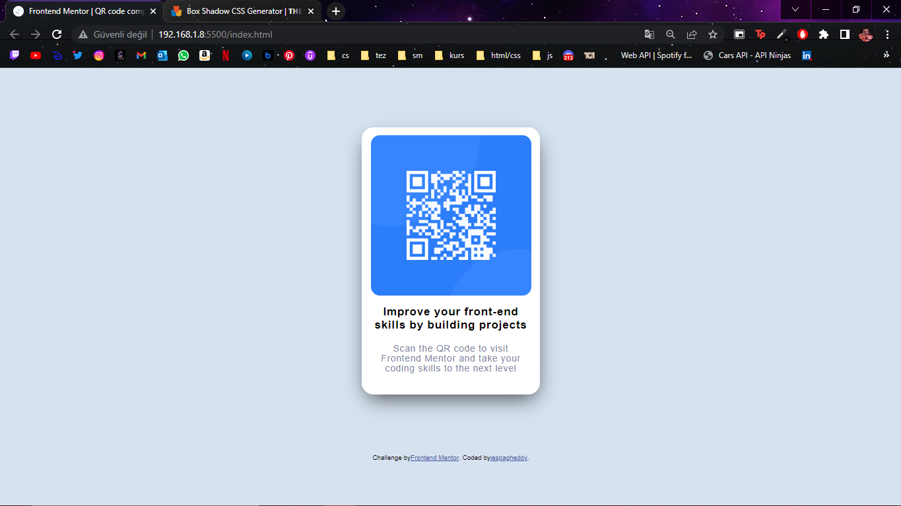

# Frontend Mentor - QR code component solution

This is a solution to the [QR code component challenge on Frontend Mentor](https://www.frontendmentor.io/challenges/qr-code-component-iux_sIO_H). Frontend Mentor challenges help you improve your coding skills by building realistic projects. 

## Table of contents

- [Overview](#overview)
  - [Screenshot](#screenshot)
- [My process](#my-process)
  - [Built with](#built-with)
  - [Useful resources](#useful-resources)
- [Author](#author)

## Overview

### Screenshot

## My process

### Built with

- Semantic HTML5 markup
- CSS custom properties
- Flexbox

### Useful resources

- [box-shadow](https://html-css-js.com/css/generator/box-shadow/) - This site help me to find perfect box shadow code for my card.

## Author

- Frontend Mentor - [@isaerturk](https://www.frontendmentor.io/profile/isaerturk)
- Twitter - [@isaertrk](https://www.twitter.com/isaertrk)
